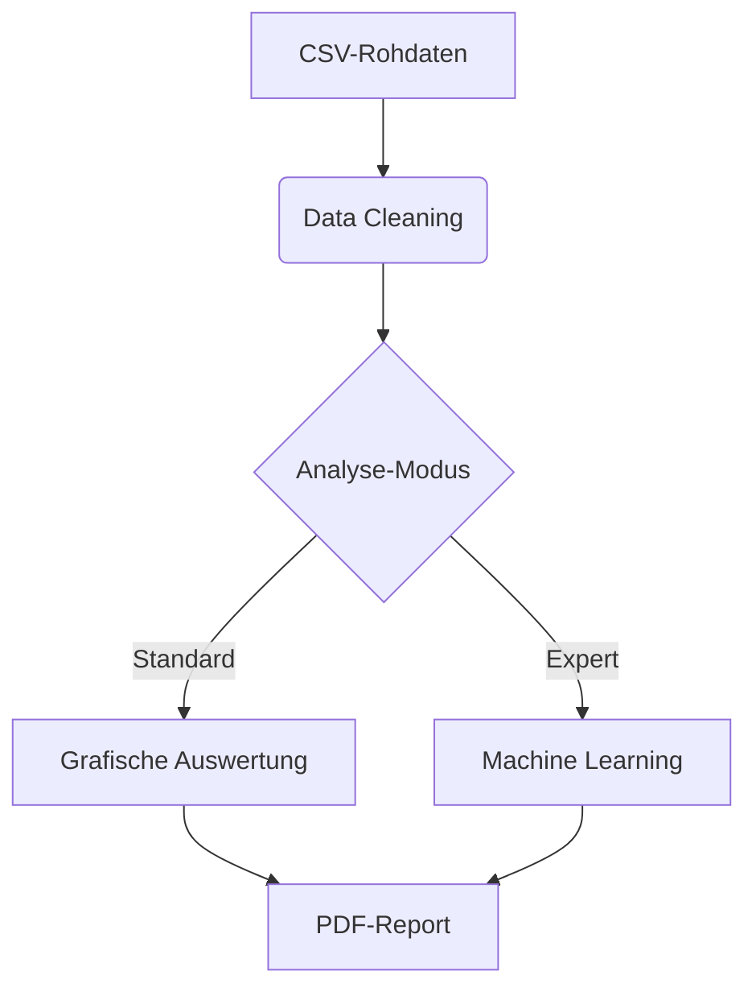

# 🌍 AirScout-Analytics

## Umweltkontrollsystem – Sensordatenanalyse & Dashboard

Dieses Projekt erfasst und analysiert umfangreiche [Umweltdaten](https://www.kaggle.com/datasets/avitarus/hyperlocal-urban-environmental-monitoring-dataset) aus Neustadt an der Weinstrasse (Juli 2025), die von einem [Arduino Mega 2560](https://github.com/Watchkido/AirScout-Firmware) über eine Vielzahl von Sensoren gesammelt werden. Ziel ist ein interaktives Dashboard mit Zeitreihen-, Filter- und Kartendarstellungen zur Visualisierung und Analyse der Messdaten.

[Komoot Tour anzeigen](https://www.komoot.com/de-de/tour/2413578613?share_token=apHyFIhrf2YKNJ2b1SoPXXkasVKoAAOQN9jk74EsBOb3qIL1sM&profile=1)


## 📊 Projektziele

- **Erfassung** von Umweltparametern mit bis zu 100 kHz Abtastrate
- **Zeitreihenanalyse** für Temperatur, Gase, Licht, Geräusche, Strahlung usw.
- **GPS-gestützte Kartendarstellung** der Sensorwerte
- **Filtern & Segmentieren** der Daten nach Ort, Zeit, Messwerten
- **Visualisierung** mit interaktiven Diagrammen (Heatmaps, Scatterplots, Verlaufslinien)
- **Erweiterbares Dashboard** zur Echtzeit- oder nachträglichen Analyse

---

## Kaggle Datensatz

[Hyperlocal Urban Environmental Monitoring Dataset](https://www.kaggle.com/datasets/avitarus/hyperlocal-urban-environmental-monitoring-dataset)

---

## ⚙️ Tech Stack

- **Python 3.x**
- **Pandas & Numpy** – Datenverarbeitung
- **Matplotlib & Seaborn** – Standardplots
- **Plotly & Dash** oder **Streamlit** – Interaktive Dashboards
- **Geopandas & Folium** – Kartendarstellungen
- **Jupyter Notebooks** – Prototyping & Analyse
- **Git & GitHub** – Versionskontrolle
- **Arduino** – Datenlogger-Hardware

---

## 🧠 Kernfunktionen

### 1. Automatisierte Datenpipeline



### 2. Wichtige Skripte

| Skript                | Beschreibung                           | Output   |
| --------------------- | -------------------------------------- | -------- |
| `csv_analyser.py`     | Hauptpipeline (Datenanalyse + Visuals) | HTML/PDF |
| `geo_mapper.py`       | Interaktive Pollution-Maps             | GeoJSON  |
| `report_generator.py` | Autom. Report-Erstellung               | PDF      |

---

### 📈 Visualisierung


---

## 📝 Prüfungsrelevante Aspekte

1. **Software-Engineering**:

2. **Data Science**:
   - Zeitreihenanalyse
   - Geospatiale Visualisierung
   - Signalverarbeitung (Audio)

---

## 🧪 Testprotokoll

```bash
pytest tests/ --cov=src/ --cov-report=html
```

| Modul            | Abdeckung | Status |
| ---------------- | --------- | ------ |
| Datenbereinigung | 100%      | ok     |
| Geo-Mapping      | 100%      | ok     |
| Report-Gen       | 100%      | ok     |

---

## 📜 Lizenz & Danksagung

**MIT License** - Speziell entwickelt für die Python-Prüfung 2025.  
_Betreut durch [Dr Ichmach Dasselbst]_

**Kontakt:**  
Frank Albrecht | [airscout@watchkido.de](mailto:airscout@watchkido.de)

## Schnellstart

1. Repository klonen:

   git clone https://github.com/Watchkido/AirScout-Analytics/
